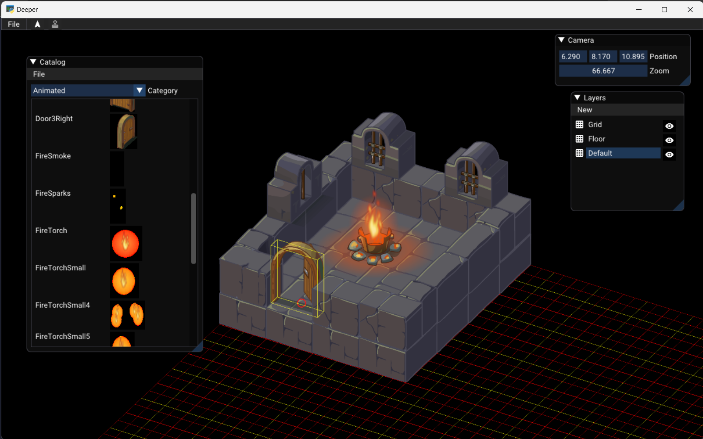
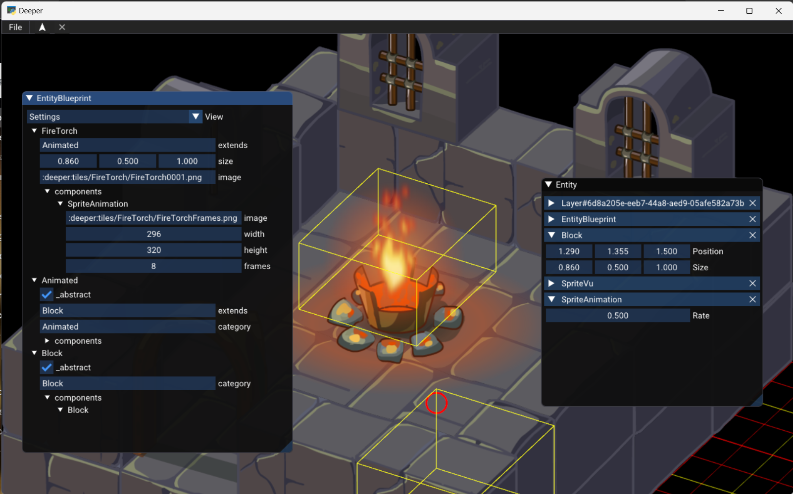

# Deeper :skull:

Dungeon RPG using [The Python Arcade Library](https://arcade.academy/)

Tiles courtesy of [Dragosha](https://dragosha.com/free/dungeon-part-1-tiles.html)

## Development

You need to have [Rust](https://www.rust-lang.org/tools/install) installed

```bash
git clone https://github.com/kfields/deeper.git
cd deeper
poetry shell
poetry install
maturin develop
python -m deeper
```

## Resources

:link:[Parry](https://parry.rs/)

:link:[PyO3](https://github.com/PyO3/pyo3)

:link:[Maturin](https://github.com/PyO3/maturin)

:link:[Maturin Action](https://github.com/messense/maturin-action)

# Screen Shots




